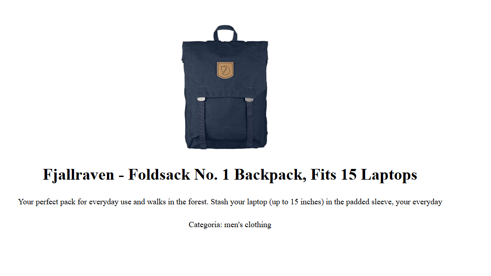

## Site E-commerce com API
### Descrição
Site de E-commerce utilizando uma Fake Store API para exibir informações dos produtos, como imagem, avaliação e preço, diretamente na Home Page. Ao selecionar um produto, o usuário é redirecionado para outra página com uma breve descrição. Além disso, há um botão que leva a uma página dedicada à busca de produtos pelo nome.

## Tecnologias utilizadas
• HTML
• CSS
• JavaScript

